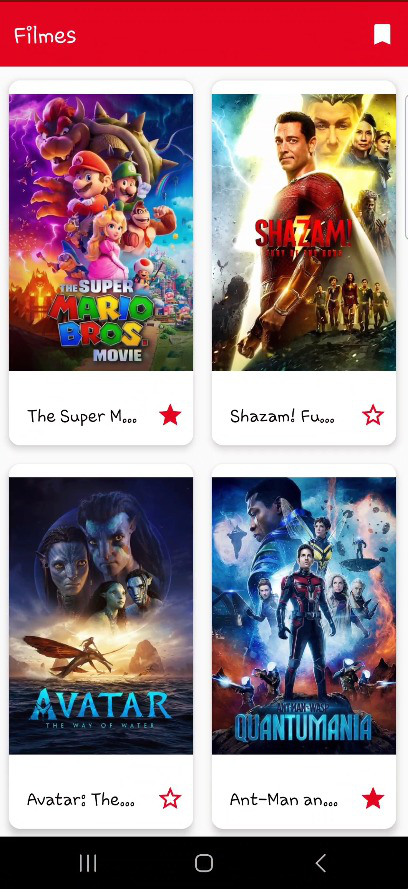
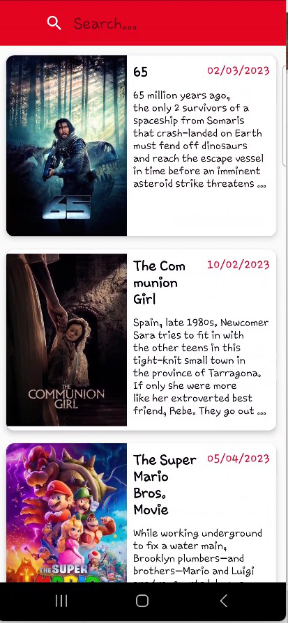
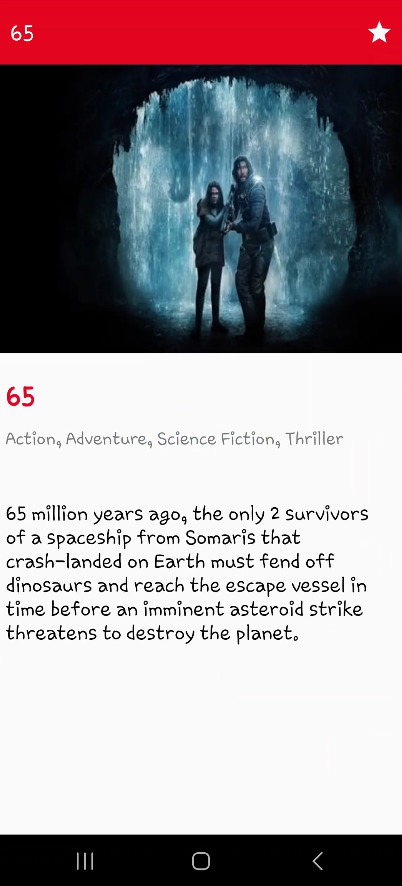

# inChurch Recruitment Process - Android Developer

Nessa parte do processo de recrutamento você desenvolverá uma aplicação Android. O desafio deve ser desenvolvido em Kotlin e utilizando libs conhecidas de mercado. A aplicação será um catálogo dos filmes populares, utilizando a [API](https://developers.themoviedb.org/3/getting-started/introduction) do [TheMovieDB](https://www.themoviedb.org/).

* * *

## O que foi feito:

+ ### Requisitos Obrigatórios:
    * [x] Tela de Listagem de Filmes exibindo os filmes melhores classificados. Utilizar esse [endpoint](https://developers.themoviedb.org/3/movies/get-popular-movies).
    * [x] Loading no carregamento da listagem de filmes.
    * [x] Tratamento de erros(falta de internet e erro na api) na tela de Listagem de Filmes.
    * [x] Tela de Favoritos com a listagem dos filmes marcados como favorito. Essa tela será acessada no ícone de favoritos na toolbar da Listagem de Filmes.
    * [x] Tela de detalhe do filme. Para as informações de gêneros do filme, utilize esse [endpoint](https://developers.themoviedb.org/3/genres/get-movie-list).
    * [x] Ação de favoritar um filme na tela de detalhe. Todo o controle será em armazenamento local.

#
+ ### Pontos extras:
    * [x] Paginação com scroll infinito na tela de filmes.
    * [x] Filtro de busca pelo nome do filme na tela de Favoritos. Exibir uma tela diferente para quando não houver resultado na busca.
    * [x] Ação de remover o filme da lista de Favoritos.
    * [] Testes unitários.
    * [] Testes funcionais.

#
+ ### Desenvolvimento do Projeto

  A primeira tela deste aplicativo é a tela de filmes. Esta tela informa os filmes mais populares da API The Movies BD, com scroll infinito podendo ver todos os filmes que possuem cadastrados. Também possui possibilidade de favoritar os filmes preferidos.

  A segunda tela deste aplicativo surge quando se clica no icone da toolbar da tela de filmes. Nela pode-se ver uma lista de filmes favoritados e também pode-se pesquisar por um filme em especifico

  A Ultima tela deste aplicativo é a tela de detalhes. Nela é possivel ver detalhes do filme e possui um icone de favoritos onde o usuário pode desfavoritar o filme em questão( ou favoritar caso esteja acessando este pela tela de filmes)

#
+ ### FrameWorks e Bibliotecas
    * Livedata: As exibições escutam as respostas de processamento de imagem usando livedata. Sua vantagem é estar vinculado ao ciclo de vida da atividade e ter seu observador removido sempre que a atividade é encerrada.
    * Coroutines: Biblioteca Kotlin para Trabalhar com Funções Assíncronas.
    * Koin: Biblioteca para Injeção de Dependências
    * Retrofit: Biblioteca para comunicação com APIs RESTful ajudando a definir de forma intutiva como as requisições HTTP devem ser realidades e como tratar a resposta
    * Picasso: Biblioteca para carregamento de imagens
    * OkHttp3: para suporte a api 
    * Moshi: para conversão de Json para objetos
    * SharedPreferences: Classe no android para armazenar dados simples e primitivos no dispositivo do usuário

#
+ ### Arquitetura
    * Arquitetura MVVM: Arquitetura Recomendada pelo Google
    * Clean Archtecture: Implementação das camdas de data, domain e presentation. Foi utilizado para que o aplicativo ficasse com baixo acoplamento

#
+ ### Melhorias
    * Implementar Testes unitários
    * Implementar Bottom Navigation para transição de telas
  